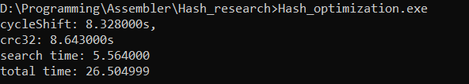
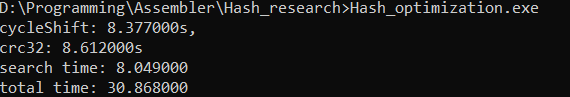
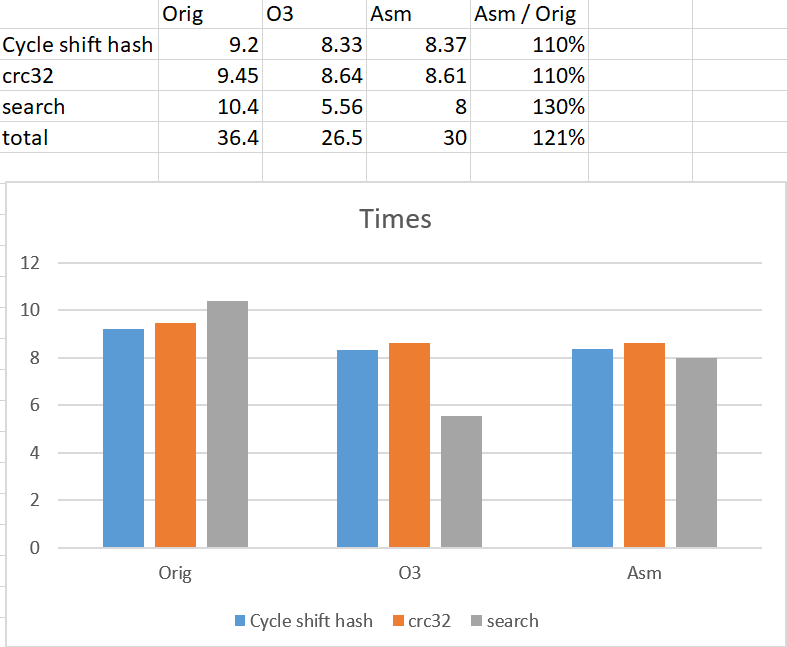

# Hash Research

In this project we will research different hash functions. We will find out which function behaves the best with large texts. Then we will optimize the calculations of these funcitons with inline assembler.


## Looking at different functions

We will research these 6 functions:
* Constant
```
unsigned int ConstHash(struct String value) {
	assert(value.string != NULL);
	
	return 1;
}
```
* Length of the word
```
unsigned int WordLenHash(struct String value) {
	assert(value.string != NULL);

	return strlen(value.string) % (MAX_HASH + 1);
}
```
* Sum of ASCII codes of the letters
```
unsigned int WordSumHash(struct String value) {
	assert(value.string != NULL);

	unsigned int res = 0;
	for (int i = 0; i < strlen(value.string); ++i) {
		res += value.string[i];
	}

	return res % (MAX_HASH + 1);
}
```
* Sum of ASCII codes divided by length
```
unsigned int WordDivLenHash(struct String value) {
	assert(value.string != NULL);

	unsigned int len = strlen(value.string);
	unsigned int sum = 0;
	for (int i = 0; i < len; ++i) {
		sum += value.string[i];
	}

	return sum / len % (MAX_HASH + 1);
}
```
* XOR between current result and current ASCII code, then cyclic shift of the result
```
unsigned int CycleShiftHash(struct String value) {
	assert(value.string != NULL);

	unsigned int len = strlen(value.string);
	unsigned int res = 0;
	for (int i = 0; i < len; ++i) {
		res ^= (unsigned int)value.string[i];

		unsigned int firstBit = res >> (sizeof(unsigned int) * 8 - 1);
		res = res << 1;
		res |= firstBit;
	}

	return res % (MAX_HASH + 1);
}
```
* CRC32
```
unsigned int Crc32Hash(struct String value) {
	assert(value.string != NULL);
	
	unsigned int res = 0;
	
	const unsigned int maxInt = 0xFFFFFFFF;
	res = maxInt;

	int len = strlen(value.string);
	char* curCh = value.string;
	while (len--) {
		unsigned int curInd = (res ^ *curCh++) & 0xFF;
		res = crc_table[curInd] ^ (res >> 8);
	}
	res = res ^ maxInt;
	
		return res % (MAX_HASH + 1);
}
```
crc_table is pre-generated from the folowing code:
```
	unsigned int crc_table[256] = {0};
	unsigned int crc = 0;

	for (int i = 0; i < 256; ++i) {
		crc = i;
		for (int j = 0; j < 8; ++j)
			crc = crc & 1 ? (crc >> 1) ^ 0xEDB88320 : crc >> 1;

		crc_table[i] = crc;
	};
```

We will store the calculated hashs in a hash table using separate chaining method (each array element contains a list of words whose hash amounts match the index of the array). We will read a large text from a file and calculate hash amounts for each word. After this we will get 6 tables, each for its hash funcition. At the end we will print all list sizes from created tables in the shown format:
```
0, 2, 6, 2, 87, 45, 
5, 7, 2, 7, 4, 3, 
...
3, 4, 8, 2, 46, 0, 
```
Earch row represents the function type and earch collumns show the list sizes. This format allows us to easily import data to Excel.

After we got all data we can analyse our functions. There are graphs of them:


As we can see, the most uniform functions are "XOR and Shift" and "CRC32". The worst funtion is of course the constant as it has the most amount of collisions (total number of words).  


## Optimisation

Let's determine how long does it take to calculate "Xor and Shift" and "CRC32"! First let's modify out program so that it doesn't generate hash tables but just calculates hash amounts. Now we have to get the times every function runs. To do this we will just call our functions 20 times in a loop and calculate the time it took to run the loop for each function: The code is:
```
int tempClocks = clock();
...<function loop>...
*function name*Clocks = clocks() - tempClocks;  // For example crc32Clocks = clocks() - tempClocks;
```

As we calculate hashs only for non-repeating words, we need to look in each iteration if current word wasn't already handled. To do this we often need to call the strcmp() function. So let's optimize this function too! But first we need to calculate which time it takes to call strcmp() for large amount of words. The time calculation goes the same way as for hash functions.   

At the end of the program we will just print all times we got.

After running our program we got the folowing times:

  


Now let's try to compile with the highest optimize option of GCC - "O3"!
The results are:



Much better! But let's try to use assembly to try to get as close as possible to these results.

We will replace the folowing functions with assembly code:

* CycleShiftHash:
```
unsigned int CycleShiftHash(struct String value) {
	unsigned int len = strlen(value.string);
	char* curCh = value.string;
	
	unsigned int res = 0;

	__asm__ volatile (".intel_syntax noprefix    \n"
					  "xor %0, %0                 \n"
					  "xor ebx, ebx               \n"
					  ".cycle_loop:               \n"
					  "mov bl, [%2]           \n"
					  "xor %0, ebx            \n"
					  "rol %0, 1              \n"
					  "inc %2                 \n"
					  "dec %1                 \n"
					  "cmp %1, 0              \n"
					  "jne .cycle_loop        \n"
					  ".att_syntax                \n"
					  : "=a" (res)
					  : "c" (len), "r" (curCh)
					  : "ebx", "edx");

	return res % (MAX_HASH + 1);
}
```

* Crc32Hash:
```
unsigned int Crc32Hash(struct String value) {
	char* curCh = value.string;

	__asm__ volatile (".intel_syntax noprefix      \n"
					  "mov %0, 0xFFFFFFFF          \n"
					  ".crc_loop:                  \n"
					  "xor rdx, rdx                \n" // Current index
					  "mov dl, [%2]                \n"
					  "inc %2                      \n"
					  "xor edx, %0                 \n"
					  "and edx, 0xFF               \n" // Got current index

					  "mov rdi, %1                 \n"
					  "shl rdx, 2                  \n"
					  "add rdi, rdx                \n"
					  "mov ecx, [rdi]              \n"

					  "shr %0, 8                   \n"
					  "xor %0, ecx                 \n" // Got current res

					  "cmp byte ptr [%2], 0        \n"
					  "jne .crc_loop               \n"

					  "xor %0, 0xFFFFFFFF          \n"
					  ".att_syntax                 \n"
					  : "=a" (res)
					  : "b" (crc_table), "S" (curCh)
					  : "rdx", "rcx", "rdi");

	return res % (MAX_HASH + 1);
}
```

* strcmp:
```
int Strcmp(char* str1, char* str2) {
	int res = 0;

	__asm__ volatile (".intel_syntax noprefix       \n"
					  "xor rax, rax                 \n"
					  ".cmp_loop:                   \n"
					  "cmpsb                        \n"
					  "jne .end                     \n"
					  "dec rsi                      \n"
					  "lodsb                        \n"
					  "cmp al, 0                    \n"
					  "jne .cmp_loop                \n"

					  ".end:                        \n"
					  "xor ebx, ebx                 \n"
					  "mov bl, [rsi - 1]            \n"
					  "sub bl, [rdi - 1]            \n"

					  ".att_syntax                  \n"
					  : "=b"(res)
					  : "S"(str1), "D" (str2)
					  : "rax");
	return res;
}
```

* strlen (because some hash functions use it):
```
size_t strlen_fast(char* string) {
	size_t res = 0;
	
	__asm__ volatile (".intel_syntax noprefix    \n"
					  "mov rax, %1               \n"
					  "dec rax                   \n"
					  ".strlen_loop:             \n"
					  "inc rax                   \n"
					  "cmp byte ptr [rax], 0     \n"
					  "jne .strlen_loop          \n"
					  "mov %0, rax               \n"
					  "sub %0, %1                \n"
					  ".att_syntax               \n"
					  : "=r" (res)
					  : "b" (string)
					  : "rax");

	return res;
}	
```

Let's measure the times with our inline assembly:



## Results
At the end we got the folowing times:

As we can see, we got pretty near to O3 times and even got ahead of O3 in CRC32!